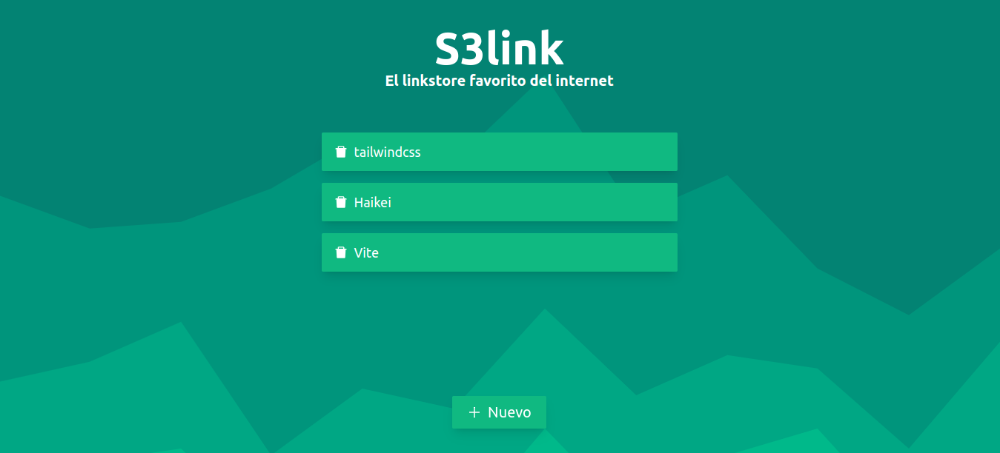

# S3link



## Tabla de contenido

- [Sobre](#about)
- [Instalación](#getting_started)

## Sobre <a name = "about"></a>

Aplicación contruida con React y Tailwindcss para guardar enlaces

## Instalación <a name = "getting_started"></a>

### Prerrequisitos

- Nodejs (18.12.1)
- npm (8.19.2)

### Clonar repositorio

```console
git clone git@github.com:raulodev/selink.git
```

### Acceder al proyecto e instalar dependencias

```console
$ cd selink/
$ npm install
```

### Levantar servidor de desarrollo

```console
$ npm run dev
```
